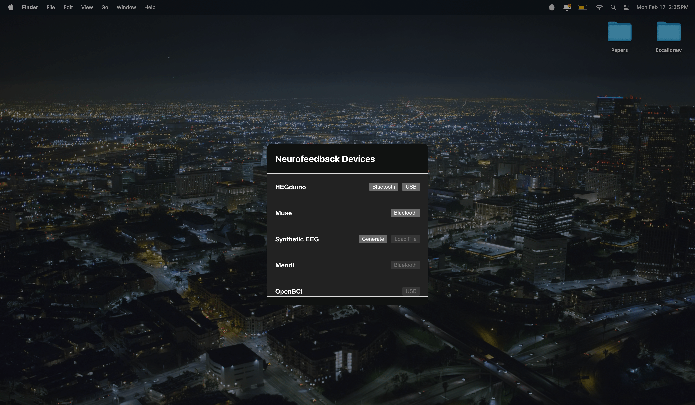
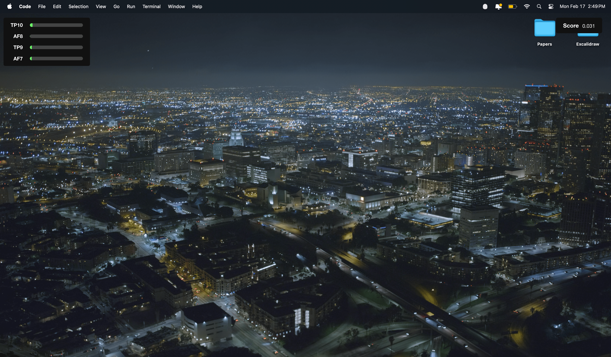

# Neurosys Starter Kit
A template application for providing system-level neurofeedback using the [`neurosys`](https://github.com/neuralinterfaces/neurosys) SDK.

## Installation
Coming soon...

## Application Overview
### Devices
#### EEG
1. **Muse**: Connect to Muse EEG devices using Bluetooth.

#### HEG
1. **HEGduino**: Connect to the [HEGduino](https://github.com/joshbrew/HEG_ESP32_Delobotomizer) using a Bluetooth or USB connection.

### Features
1. **Bandpowers**: Calculate relative bandpowers across all channels in the provided window.
2. **HEG Ratio**: Calculate HEG features (e.g. red and infrared power) in the provided window.

### Score Evaluations
1. **Alpha Score**: Alpha bandpower across all channels.
2. **HEG Ratio**: rHEG ratio (red / infrared) to approximate blood flow.

### Plugins
#### Outputs
1. **System Volume**: Adjust the system volume.
2. **System Brightness**: Adjust the system brightness using an overlay.
3. **Cursor Animation**: Display the score using a circle around the cursor.
4. **Inspect Features**: Visualize the calculated features in real-time.

## Getting Started
> **Note**: You can use the shortcut `Ctrl + q` to quit the application at any time.

### Connecting a Neurofeedback Device
To connect your device, click on the brain icon in the system tray and select the Connect to Device option from the list.



After completing the device connection workflow, you'll be able to configure other settings.

## Changing the Score Evaluation
The first evaluation option will be chosen automatically. To change the selection, click on the brain icon in the system tray and select an alternative Score option from the list.

### Defining your Outputs
To define your outputs, click on the brain icon in the system tray and select any of the available Outputs—as many as you like!



You can save your selection by clicking on the Save Settings tray option.

## Customization
Neurosys declares plugins in the `commoners.config.ts` file. From this, evaluation and output plugins are automatically detected and loaded into the system tray.

For more information on plugin design, please refer to the [Neurosys SDK documentation](https://github.com/neuralinterfaces/neurosys#plugin-design)


## Common Issues
### Native Node Modules
It's likely that `robot.js` (if included) will give you trouble when being used through Electron. To solve this, you can try the following:
```
npm rebuild.js
```

This will rebuild the necessary modules for your current operating system.